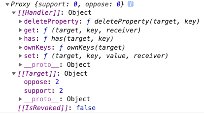
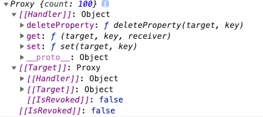

# Reactivity API


## 1. reactive

> 响应式数据，使用Proxy进行代理

```html
  <p><button @click="change(true)">支持</button> 支持：{{state.support}}</p>
  <p><button @click="change(false)">反对</button> 反对：{{state.oppose}}</p>
```

```js
import { reactive } from 'vue'
export default {
  setup(props) {
    const state = reactive({
      support: 0,
      oppose: 0,
    })
    const change = (is) => {
      is ? state.support++ : state.oppose++
    }
    return {
      state,
      change
    }
  }
}
```



## 2. readonly

>传入一个对象（响应式或普通）或 ref，返回一个原始对象的只读代理一个只读的代理是“深层的”，对象内部任何嵌套的属性也都是只读的

```html
  <div>
    readonly {{original.count}} {{copy.count}}
  </div>
```

```js 
import { reactive, readonly } from 'vue'
export default {
  setup() {
    const original = reactive({
      count: 100
    })
    const copy = readonly(original)
    setTimeout(() =>{
      original.count = 10000
    }, 1000)
    // copy.count = 10000 // Set operation on key "count" failed: target is readonly.
    return {
      original,
      copy
    }
  }
}
```

```js
const original = reactive({ count: 0 })
const copy = readonly(original)
watchEffect(() => {
  // 依赖追踪
  console.log(copy.count)
});
// original 上的修改会触发 copy 上的侦听
original.count++;
// 无法修改 copy 并会被警告
copy.count++; // warning!

```



## 3. isProxy

> 检查对象是否由`proxy`进行代理

```js
  const reactiveObj = reactive({
    count: 0,
  })
  const refObj = ref(0)
  const readonlyObj = readonly(reactiveObj)
  const obj = { a: 0 }
  const handler = {
    get: function (obj, prop) {
      return prop in obj ? obj[prop] : 37
    }
  }
  const p = new Proxy({}, handler)

  console.log(isProxy(reactiveObj)) // true
  console.log(isProxy(refObj)) // false
  console.log(isProxy(readonlyObj)) // true
  console.log(isProxy(obj)) // false
  console.log(isProxy(p)) // true
```

## 4. isReactive

> 检查对象是否通过`reactive`创建的代理对象

```js
  const state = reactive({count: 0})
  const copy = readonly(state)
  const obj = { a: 0 }
  const handler = {
    get: function (obj, prop) {
      return prop in obj ? obj[prop] : 37
    }
  }
  const p = new Proxy({}, handler)
  console.log(isReactive(state)) // true
  console.log(isReactive(copy)) // true
  console.log(isReactive(p)) // false
```

## 5. isReadonly

> 检查对象是否为只读代理

